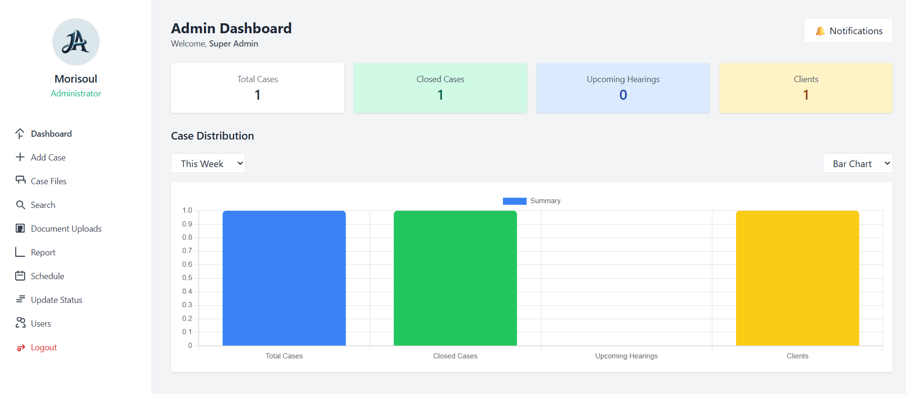

# e-Justice Case Management System

A web-based system to help lawyers, admins, and clients manage legal cases more efficiently.

## Features
- 📁 Manage Case Files
- 🗓️ Schedule Hearings
- 📨 Password Reset via Email
- 📊 Dashboard with Stats
- 📎 Upload Legal Documents

## Technologies
- PHP (with PDO)
- MySQL
- PHPMailer
- Tailwind CSS
- Chart.js

## Developed by
M0RISOUL  

---

> ⚠️ **Note:** This system is for educational use only.
